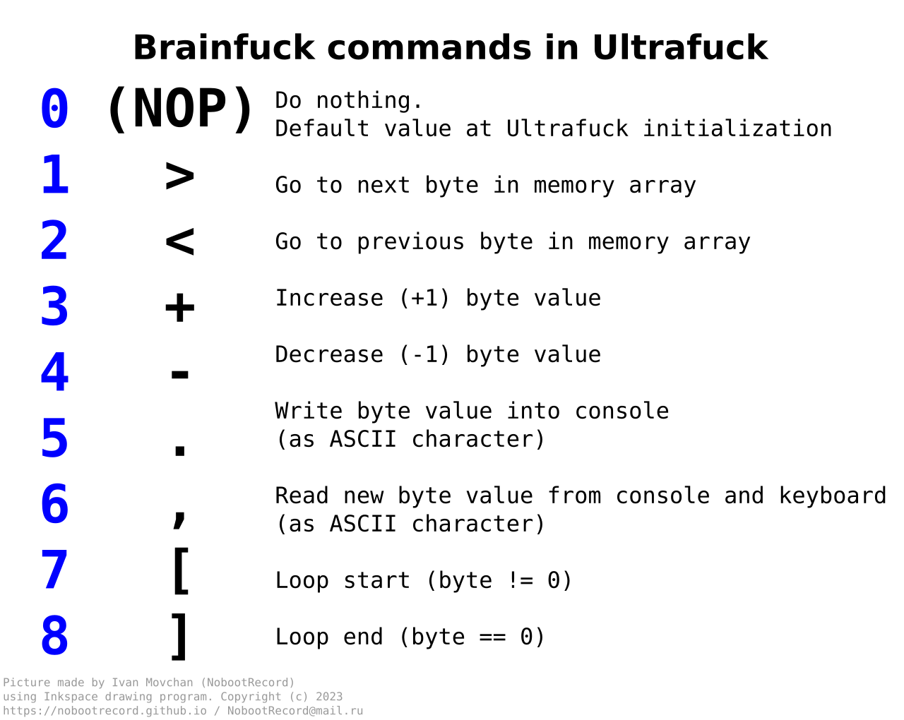

<div align="center">


# Ultrafuck

Brainfuck programming language made more hardcore and minimalistic

[Русская версия](README.ru.md)&emsp;/&emsp;[What is this?](#what-is-this) / [How does it work?](#how-does-it-work) / [Usage](#usage) / [Compile options](#compile-options) / [License](#license) / [Thanks](#thanks)

</div>

<br><br>

# What is this?

<b>Ultrafuck</b> is an modified version of legendary Brainfuck (BF) esoterical programming language. It has very minimalistic syntax and supports a few commands (and comments too).

Original Brainfuck has been created by Urban Müller in 1993 year, inspired by FALSE programming language. It has about 8 commands that makes much harder programming in Brainfuck (unlike other languages). Brainfuck is very popular language nowadays - it has 10+ active forks and modifications. Ultrafuck project is one of these :)

In Brainfuck language user needs to control one big memory array, increase/decrease memory cell values, write data into console and do other stuff. In Ultrafuck user needs to select some Brainfuck command by... other commands. That's why Ultrafuck is much harder in coding, as I think.

<br>

# How does it work?




<br>

There is one integer value called ```cmdIndex``` (in example). By entering ```>``` or ```<``` user increases/decreases its value (like switching TV sound volume lol). By entering ```~``` user resets ```cmdIndex``` value to zero. By entering ```!``` command user executes some Brainfuck command depending on this array:

0. **NOP**\
It does nothing. This is default ```cmdIndex``` value.
1. **>**\
Go to next memory cell
2. **<**\
Go to previous memory cell
3. **+**\
Increase (+1) current memory cell value
4. **-**\
Decrease (-1) current memory cell value
5. **.**\
Write current memory cell value into console as *ASCII character*
6. **,**\
Read *ASCII character* from keyboard and write into current memory cell
7. **[**\
Start loop (current memory cell value != 0)
8. **]**\
End loop (current memory cell value = 0)

<br>

Ultrafuck also supports multi-line comments that can make your ~life~ code much easier to understand (I hope).

```
***

This is simple multi-line comment in my shitty coded Ultrafuck program!!!!111

MUM IM CODIN DON DIZTRUB ME PLAZ

***
```

<br>

# Usage

Ultrafuck must be executed from command line in this format:

&emsp;&emsp;```$UF_EXECUTABLE [filename] <arguments>```

* ```$UF_EXECUTABLE```\
Ultrafuck interpretator executable file.\
**Linux:** ```./ue``` or ```./ue64```\
**Windows:** ```ue.exe``` or ```ue64.exe```
* ```[filename]```\
Ultrafuck code filename. Recommended using UTF-8 encoded TXT files. You can also (just for fun) rename file to ```*.UF``` extension
* ```<arguments>```\
Additional command-line arguments. Currently supported:\
--- ```-q / --quiet```\
Be quiet, do not display any additional messages - program output only.

What about code editors, you can use even classic Windows Notepad, as Ultrafuck practically _does not_ have any syntax and looks like plain text.

<br>

# Compile options

Ultrafuck is currently being compiled and released using GCC and MinGW (the latest versions are recommended for usage). There is no different OS API used, so that's why the project can be easily compiled under any OS different from Linux and Windows.

By the way you can also use some other compilers like Visual C++, Tiny C Compiler, et cetera - why not.

If you have any problems with compiling Ultrafuck on your machine, please contact me immediately - I will help you as much as I can.

<br>

# License

Ultrafuck project is licensed under the terms of **MIT License**. See [LICENSE](LICENSE) file for more info.

<br>

# Thanks

* **Urban Müller**\
Original Brainfuck author
* **[nlasted](https://github.com/nlasted)**\
Helped with switching to Linux :)

<br><br>

<div align="center">

## Code and design by Ivan Movchan (NobootRecord). Copyright &copy; 2023
### [https://nobootrecord.github.io](https://nobootrecord.github.io) / [NobootRecord@mail.ru](mailto:NobootRecord@mail.ru)

<br><br>


</div>