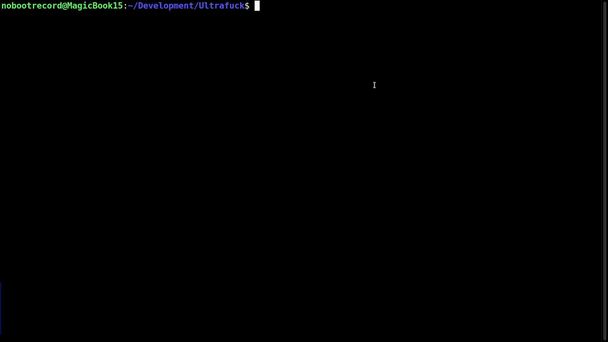

#  Ultrafuck

### Brainfuck programming language made more hardcore
### Brought to you by: [NobootRecord](https://github.com/NobootRecord)
### Platform: Win32
### Status: ???

* * *

### What is this?

Ultrafuck is an esoteric programming language based on very famous Brainfuck programming language.\
Brainfuck is known for its minimalistic syntax and a few count of commands, while Ultrafuck is (not) known for its hardcore character.\
Actually, in Ultrafuck you have to execute the same Brainfuck commands (+ some extras Ultrafuck-only) by... executing another commands. It is like switching TV channels, is not it?

I do not know what the hell did I create **this**, but okay.

### Usage

```Usage: uf [filename] [-c outfilename | -v] [-q]```

### Coding

```
>		Next BF command
<		Previous BF command
!		Execute command
~		Null
[]		Loop
{}		Endless Loop

BF commands:

1:		Next memory cell
2:		Previous memory cell
3:		Increase memory cell value
4:		Decrease memory cell value
5:		Write memory cell value into console (as ASCII character)
6:		Read memory cell value from keyboard (as ASCII character)
7:		Set random memory cell value
8:		Write memory cell value into console (as number)
9:		Break (stop program execution)
```

See [this video (in Russian)](https://www.youtube.com/watch?v=V1bT8TtI78k&t=9s) to understand how does it all work.

### Features

* Written in pure C x86, can be easily recompiled for any platform
* Lightweight and blazingly fast
* ULTIMATE POWERED MEGA TURBO F\*\*KING SHITCODE!!!! (even I can't read it lol)
* Licensed under the terms of [The Unlicense](LICENSE)
* Sample Text
* im bored аааыаыыааыаыаааы
* Ошибка сегментирования (стек памяти сброшен на диск)

### Screenshots


MAMA IM HACKERMAN
<br>


Ultrafuck is live (GIF)
<br>
