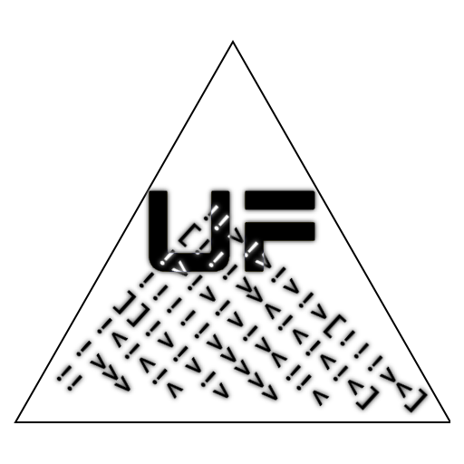
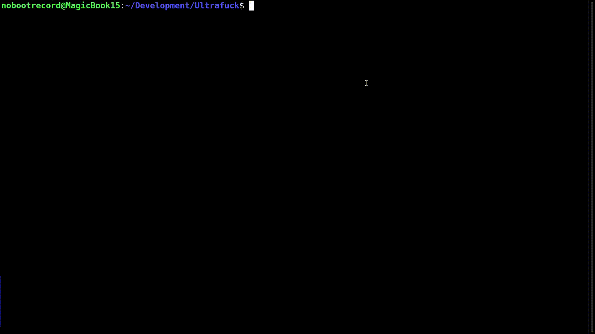

<div align="center">



# Ultrafuck

Эзотерический язык программирования, вдохновлённый знаменитым Brainfuck

[English version](README.md)

</div>

<br><br>

# 0x00. Что это такое?

<b>Ultrafuck</b> - это модицифированная версия легендарного и всемирно известного эзотерического языка программирования Brainfuck (BF), известного своим минимализмом и невероятной сложностью в программировании на нём же.

Оригинальный Brainfuck был создан Урбаном Мюллером (Urban Müller) в далёком 1993 году (уже 30 лет прошло, офигеть) и вдохновлён не менее интересным языком FALSE. В Brainfuck присутствует лишь 8 команд и весьма скромные возможности - однако благодаря этому Brainfuck и стал популярен. В скором времени появилось множество "улучшенных" (или наоборот) версий этого языка - и одной из таких версий как раз является проект Ultrafuck :)

Если в обычном Brainfuck пользователю нужно страдать с ячейками памяти в огроменном массиве байтов, увеличивать/уменьшать их значения, переходить от одной ячейки к другой - то в Ultrafuck всё **гораздо** сложнее (и интереснее): нужно ещё и выбрать, а затем исполнить нужную Brainfuck-команду. Этим Ultrafuck и интересен, на мой взгляд...

<br>

# 0x01. Чем же так отвратителен Ultrafuck?

Подробности - в [README2.ru](README2.ru.md). Читать на свой страх и риск.

<br>

# 0x02. Использование

Ultrafuck - консольное приложение, поэтому запускать его придётся из командной оболочки вашей ОС с использованием следующей команды:

&emsp;&emsp;```$UF_EXECUTABLE [filename] <arguments>```

* ```$UF_EXECUTABLE```\
Исполняемый файл Ultrafuck.\
**Linux:** ```./ue``` или ```./ue64```\
**Windows:** ```ue.exe``` или ```ue64.exe```
* ```[filename]```\
Имя файла вашей замечательной программы на Ultrafuck. Рекомендуется использовать простейшие текстовые файлы в кодировке UTF-8. Можно по приколу переименовать на расширение *.UF* - УК РФ не запрещает
* ```<arguments>```\
Дополнительные аргументы запуска Ultrafuck. На данный момент поддерживаются следующие аргументы:\
--- ```-q / --quiet```\
Не выводить дополнительные сообщения, только вывод самой программы

В качестве редактора кода... да хоть на паяльнике пишите (через азбуку Морзе, кайф), хоть Visual Studio последней версии качайте. В Ultrafuck, как и в Brainfuck, очень минималистичный и простой синтаксис, не нуждающийся в какой-либо подсветке кода.

<br>

# 0x03. Компиляция из исходных кодов

На данный момент Ultrafuck разрабатывается и компилируется с использованием инструментов MinGW (советую использовать последние версии). Программа не зависит от API какой-либо ОС, поэтому может быть легко собрана на другие ОС, помимо Windows.

Хотите использовать Visual C++, Tiny C Compiler и тому подобные компиляторы? На здоровье, мне не жалко :)

Не компилируется? Пишите мне - помогу.

<br>

# 0x04. Лицензия

Проект Ultrafuck лицензирован по **The Unlicense**. Подробности - в файле [LICENSE](LICENSE).

Ну а если серьёзно - можете делать с проектом всё что хотите, мне глубоко плевать на него.

<br>

# 0x05. Авторы

* **Иван Мовчан (NobootRecord)**\
	Автор Ultrafuck
	
* Урбан Мюллер (Urban Müller)\
Создатель Brainfuck

<br><br>

Авторские права &copy; 2023. Все права украдены.

<div align="center">

<br><br>



</div>