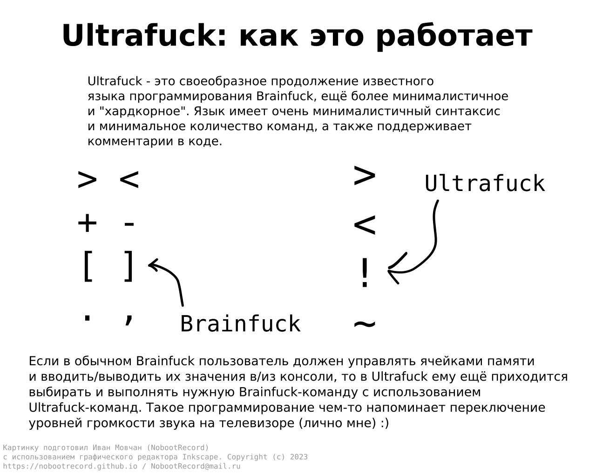
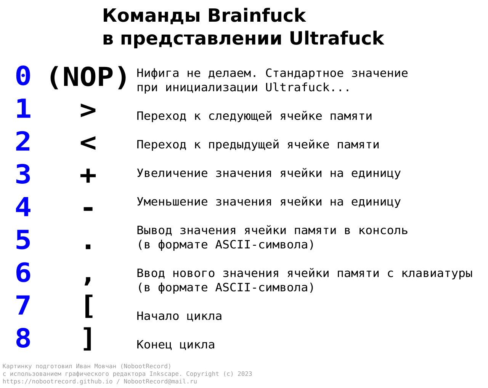

<div align="center">


# Ultrafuck

Эзотерический язык программирования, вдохновлённый знаменитым Brainfuck

[English version](README.md)&emsp;/&emsp;[Что это такое?](#что-это-такое) / [Чем он так хорош?](#чем-же-так-хорош-отвратителен-ultrafuck) / [Использование](#использование) / [Компиляция из исходных кодов](#компиляция-из-исходных-кодов) / [Лицензия](#лицензия) / [Благодарности](#благодарности)

</div>

<br><br>

# Что это такое?

<b>Ultrafuck</b> - это модицифированная версия легендарного и всемирно известного эзотерического языка программирования Brainfuck (BF), известного своим минимализмом и невероятной сложностью в программировании на нём же.

Оригинальный Brainfuck был создан Урбаном Мюллером (Urban Müller) в далёком 1993 году (уже 30 лет прошло, офигеть) и вдохновлён не менее интересным языком FALSE. В Brainfuck присутствует лишь 8 команд и весьма скромные возможности - однако благодаря этому Brainfuck и стал популярен. В скором времени появилось множество "улучшенных" (или наоборот) версий этого языка - и одной из таких версий как раз является проект Ultrafuck :)

Если в обычном Brainfuck пользователю нужно страдать с ячейками памяти в огроменном массиве байтов, увеличивать/уменьшать их значения, переходить от одной ячейки к другой - то в Ultrafuck всё **гораздо** сложнее (и интереснее): нужно ещё и выбрать, а затем исполнить нужную Brainfuck-команду. Этим Ultrafuck и интересен, на мой взгляд...

<br>

# Чем же так ~хорош~ отвратителен Ultrafuck?

Обойдёмся без комментариев... или не обойдёмся.

<br>




<br>

За определённую Brainfuck-команду отвечает переменная ```cmdIndex```. Команды ```>``` и ```<``` переключают на следующую/предыдущую Brainfuck-команду в их *не*существующем меню (чем-то напоминает управление громкостью на телевизоре, не так ли?). Команда ```~``` сбрасывает значение ```cmdIndex``` на 0. А команда ```!``` в зависимости от значения переменной исполняет нужную Brainfuck-команду:

0. **NOP**\
Нифига не делает. Дефолтное значение переменной ```cmdIndex```.
1. **>**\
Перейти к следующей ячейке памяти
2. **<**\
Перейти к предыдущей ячейке памяти
3. **+**\
Инкремент (+1) значения ячейки
4. **-**\
Декремент (+1) значения ячейки
5. **.**\
Записать значение ячейки в консоль в формате *символа ASCII*
6. **,**\
Считать *символ ASCII* с клавиатуры и записать в ячейку
7. **[**\
Начало цикла (значение ячейки != 0)
8. **]**\
Конец цикла (значение ячейки = 0)

<br>

Ultrafuck также поддерживает ещё одну интересную вещь - **блок комментариев**, который делает жизнь программиста ярче и веселее.

```
***

=== ваня хакер 0x824A51D0 !!!!!!!11!! ===
взломаю школьный сервер прошиваю bios/uefi на утюги :3
девочки звоните 88005553535 пишите в контакте: http://vkontakte.ru/durov

***
```

<br>

# Использование

Ultrafuck - консольное приложение, поэтому запускать его придётся из командной оболочки вашей ОС с использованием следующей команды:

&emsp;&emsp;```$UF_EXECUTABLE [filename] <arguments>```

* ```$UF_EXECUTABLE```\
Исполняемый файл Ultrafuck.\
**Linux:** ```./ue``` или ```./ue64```\
**Windows:** ```ue.exe``` или ```ue64.exe```
* ```[filename]```\
Имя файла вашей замечательной программы на Ultrafuck. Рекомендуется использовать простейшие текстовые файлы в кодировке UTF-8. Можно по приколу переименовать на расширение *.UF* - УК РФ не запрещает
* ```<arguments>```\
Дополнительные аргументы запуска Ultrafuck. На данный момент поддерживаются следующие аргументы:\
--- ```-q / --quiet```\
Не выводить дополнительные сообщения, только вывод самой программы

В качестве редактора кода... да хоть на паяльнике пишите (через азбуку Морзе, кайф), хоть Visual Studio последней версии качайте. В Ultrafuck, как и в Brainfuck, очень минималистичный и простой синтаксис, не нуждающийся в какой-либо подсветке кода.

<br>

# Компиляция из исходных кодов

На данный момент Ultrafuck разрабатывается и компилируется с использованием инструментов GCC и MinGW (советую использовать последние версии). Программа не зависит от API какой-либо ОС, поэтому может быть легко собрана на другие ОС, помимо Linux и Windows.

Хотите использовать Visual C++, Tiny C Compiler и тому подобные компиляторы? На здоровье, мне не жалко :)

Не компилируется? Пишите мне - помогу.

<br>

# Лицензия

Проект Ultrafuck лицензирован по **MIT License**. Подробности - в файле [LICENSE](LICENSE).

<br>

# Благодарности

* **Урбан Мюллер (Urban Müller)**\
Отец Brainfuck
* **[nlasted](https://github.com/nlasted)**\
Помог с переходом на Linux :)

<br><br>

<div align="center">

## Автор программы/программирование и дизайн: Иван Мовчан (NobootRecord). Copyright &copy; 2023
### [https://nobootrecord.github.io](https://nobootrecord.github.io) / [NobootRecord@mail.ru](mailto:NobootRecord@mail.ru)

<br><br>


</div>